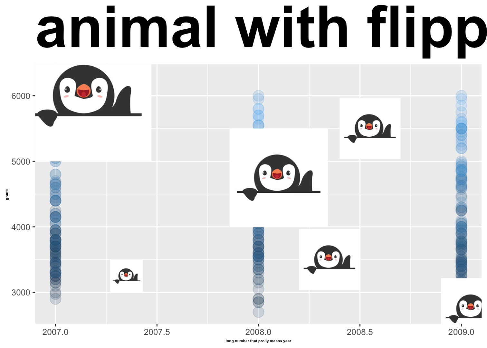
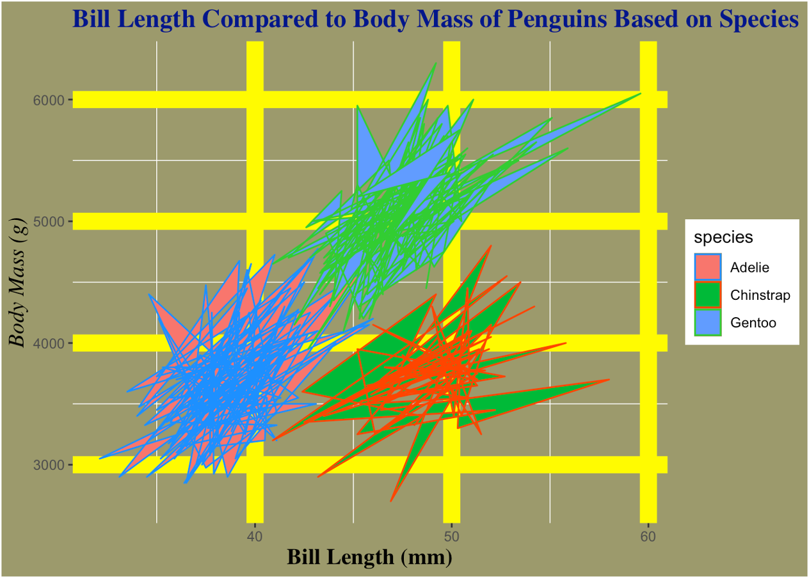
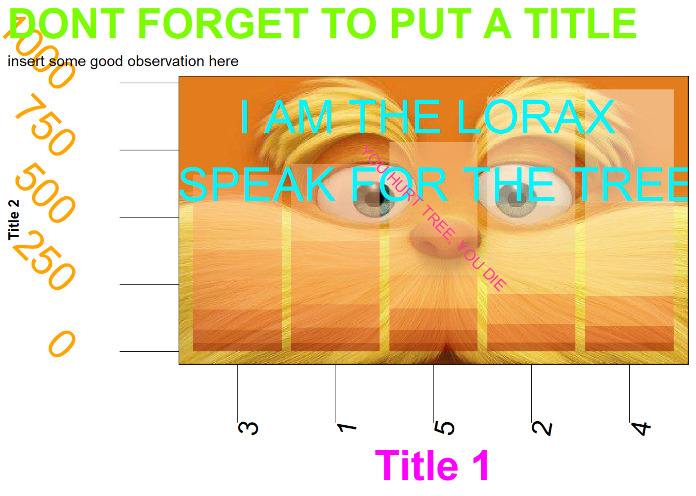
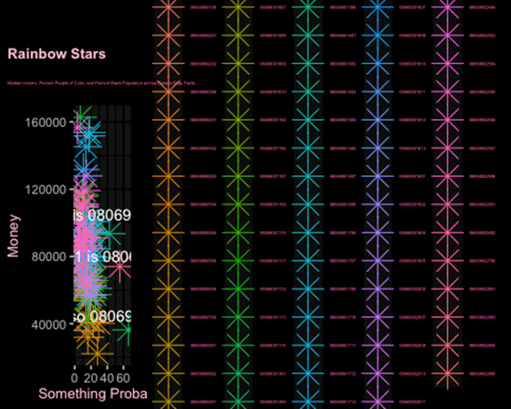

---
output:
  pdf_document
---

# Data Visualization in R

```{r include=FALSE}
knitr::opts_chunk$set(echo = TRUE, eval = TRUE, message = FALSE, warning = FALSE, tidy=TRUE)

```

This lesson will go a little deeper into data visualization and how to customize figures and tables and make them 'publication ready'.

First, set up your session by loading in the required packages:

```{r}
library(tidyverse)

```

### Air Quality Data

For today's lesson we are going to be working with some daily air quality measurements for New York City collected from May to September 1973. This dataset is already pre-installed with R.

```{r eval = TRUE, message = FALSE}
data("airquality")
```

Inspect `airquality` and the structure of the data frame.

```{r}
glimpse(airquality)
```

```{r eval = FALSE}
?airquality
```

This data contains measurements for Ozone, Solar Radiation, Wind and Temperature for each day.

<hr>

## Publication Ready Figures with `ggplot2`

For this exercise you will learn how to spice up your `ggplot2` figures with theme customization, annotation, color palettes, and more.

To demonstrate some of these advanced visualization techniques, we will be analyzing the relationships among some air quality variables for New York City.

### Let's start with this basic plot:

```{r echo = FALSE}
airquality %>% 
  ggplot(aes(x = Temp, y = Ozone)) +
  geom_point()
```

### And by the end of this lesson turn it into this:

```{r echo=FALSE, fig.height=6}
airquality %>%
  ggplot(aes(x = Temp, y = Ozone)) +
  geom_point(aes(size = Wind, color = Wind), alpha = 0.9) +
  labs(
    title = "Air Quality Data for New York City",
    subtitle = "Daily air quality measurements in New York, May to September 1973",
    x = "Temperature (degrees F)",
    y = "Ozone (ppb)",
    caption = "The data were obtained from the New York State Department of Conservation (ozone data) and the National Weather Service (meteorological data)."
  )+
  scale_radius(range = c(2, 6)) +
  theme_classic() +
  scale_color_distiller(palette = "YlGnBu", direction = 1) +   
  guides(color = guide_legend(title = "Wind"),
         size = guide_legend(title = "Wind")) +
  theme(
    axis.title = element_text(face = "bold", size = 10),
    plot.title = element_text(face = "bold",size = 15, margin = unit(c(1,1,1,1), "cm")),
    plot.subtitle = element_text(size = 10, margin = unit(c(-0.5,0.5,0.5,0.5), "cm")),
    plot.caption = element_text(face = "italic", hjust = 0),
    plot.title.position = "plot", #sets the title to the left
    legend.position = "bottom",
    legend.text = element_text(size = 8)
  ) +
  annotate(geom = "text",
           x = 85,
           y = 185,
           label = "August 25, 1973",
           size = 3,
           color = "black") +
  geom_curve(
    aes(
      x = 85,
      xend = 82,
      y = 175,
      yend = 165
    ),
    arrow = arrow(length = unit(0.2, "cm")),
    size = 0.5,
    color = "black",
    curvature = -0.3
  )
```

### General Appearance

#### Customize points within `geom_point()`

-   color or size points by a variable or apply a specific color/number

-   change the transparency with `alpha` (ranges from 0-1)

```{r}
#specific color and size value
airquality %>% 
  ggplot(aes(x = Temp, y = Ozone))+
  geom_point(color = "red", size = 4, alpha = 0.5)
```

When sizing or coloring points by a variable in the dataset, it goes within `aes():`

```{r}
# size by a variable
airquality %>% 
  ggplot(aes(x = Temp, y = Ozone)) +
  geom_point(aes(size = Wind), color = "red")
```

```{r}
# color by a variable
airquality %>% 
  ggplot(aes(x = Temp, y = Ozone)) +
  geom_point(aes(color = Wind))
```

#### Titles and limits

-   add title with `ggtitle`

-   edit axis labels with `xlab()` and `ylab()`

-   change axis limits with `xlim()` and `ylim()`

```{r}
airquality %>% 
  ggplot(aes(x = Temp, y = Ozone)) +
  geom_point(aes(size = Wind))+
  ggtitle("Air Quality Data for New York City")+
  xlab("Temperature (degrees F)")+
  ylab("Ozone (ppb)") +
  xlim(c(50, 100)) +
  ylim(c(0, 175))
```

Be cautious of setting the axis limits however, as you notice it omits the full dataset which could lead to dangerous misinterpretations of the data.

You can also put multiple label arguments within `labs()` like this:

```{r}
airquality %>% 
  ggplot(aes(x = Temp, y = Ozone)) +
  geom_point(aes(size = Wind)) +
  labs(
    title = "Air Quality Data for New York City",
    x = "Temperature (degrees F)",
    y = "Ozone (ppb)"
  ) +
  xlim(c(50, 100))+
  ylim(c(0, 175))
```

#### Chart components with `theme()`

All `ggplot2` components can be customized within the `theme()` function. The full list of editable components (there's a lot!) can be found [here](https://ggplot2.tidyverse.org/reference/theme.html). Note that the functions used within `theme()` depend on the type of components, such as `element_text()` for text, `element_line()` for lines, etc.

```{r}
airquality %>% 
  ggplot(aes(x = Temp, y = Ozone)) +
  geom_point(aes(size = Wind)) +
  labs(
    title = "Air Quality Data for New York City",
    x = "Temperature (degrees F)",
    y = "Ozone (ppb)"
  ) +
  theme(
    #edit plot title
    plot.title = element_text(size = 16, color = "blue"),
    # edit x axis title
    axis.title.x = element_text(face = "italic", color = "orange"),
    # edit y axis ticks
    axis.text.y = element_text(face = "bold"),
    # edit grid lines
    panel.grid.major = element_line(color = "black"),
  )
```

Another change you may want to make is the value breaks in the axis labels (i.e., what values are shown on the axis). To customize that for a continuous variable you can use `scale_x_continuous()` / `scale_y_continuous` (for discrete variables use `scale_x_discrete` ). In this example we will also add `angle =` to our axis text to angle the labels so they are not too jumbled:

```{r}
airquality %>% 
  ggplot(aes(x = Temp, y = Ozone)) +
  geom_point(aes(size = Wind)) +
  labs(
    title = "Air Quality Data for New York City",
    x = "Temperature (degrees F)",
    y = "Ozone (ppb)"
  ) +
  scale_x_continuous(breaks = seq(50, 100, 5))+
  theme(
    # angle axis labels
    axis.text.x = element_text(angle = 45)
  )
```

While these edits aren't necessarily *pretty*, we are just demonstrating how you would edit specific components of your charts. To edit overall aesthetics of your plots you can change the theme.

#### Themes.

*ggplot2* comes with many built in theme options (see the complete list [here](https://r-graph-gallery.com/192-ggplot-themes)).

For example, see what `theme_minimal()` and `theme_classic()` look like:

```{r}
airquality %>% 
  ggplot(aes(x = Temp, y = Ozone)) +
  geom_point(aes(size = Wind)) +
  labs(
    title = "Air Quality Data for New York City",
    x = "Temperature (degrees F)",
    y = "Ozone (ppb)"
  ) +
  theme_minimal()
```

```{r}
airquality %>% 
  ggplot(aes(x = Temp, y = Ozone)) +
  geom_point(aes(size = Wind)) +
  labs(
    title = "Air Quality Data for New York City",
    x = "Temperature (degrees F)",
    y = "Ozone (ppb)"
  ) +
  theme_classic()
```

You can also import many different themes by installing certain packages. A popular one is `ggthemes`. A complete list of themes with this package can be seen [here](https://yutannihilation.github.io/allYourFigureAreBelongToUs/ggthemes/)

### Color, Size and Legends

#### Color.

To specify a single color, the most common way is to specify the name (e.g., `"red"`) or the Hex code (e.g., `"#69b3a2"`).

You can also specify an entire color palette. One of the most common packages to work with color palettes in R is `RColorBrewer`, which has a [web application](https://colorbrewer2.org/#type=sequential&scheme=BuGn&n=3) where you can explore your data requirements and preview various palettes.

Here we want to also color the points by "Wind" and use a blue color palette. This involves 1) adding `color = Wind` to the `geom_point()` aes() and 2) specifying the "Blues" color palette from the Color Brewer library. To use Color Brewer palettes in ggplot we use the `scale_color_distiller()` function. If we were making a bar chart or any other chart that uses `fill =` instead of `color =`, we would use `scale_fill_distiller()`.

```{r}
airquality %>% 
  ggplot(aes(x = Temp, y = Ozone)) +
  geom_point(aes(size = Wind, color = Wind)) +
  labs(
    title = "Air Quality Data for New York City",
    x = "Temperature (degrees F)",
    y = "Ozone (ppb)"
  ) +
  scale_fill_distiller(palette = "Blues")
```

#### Size.

You can edit the range of the point radius with `scale_radius` :

```{r}
airquality %>% 
  ggplot(aes(x = Temp, y = Ozone)) +
  geom_point(aes(size = Wind, color = Wind)) +
  labs(
    title = "Air Quality Data for New York City",
    x = "Temperature (degrees F)",
    y = "Ozone (ppb)"
  ) +
  scale_fill_distiller(palette = "Blues") +
  scale_radius(range = c(0.5, 6))
  
```

#### Legends

In the previous plots we notice that two separate legends are created for size and color. To create one legend where the circles are colored, we use `guides()` like this, specifying the same title for color and size:

```{r}
airquality %>% 
  ggplot(aes(x = Temp, y = Ozone)) +
  geom_point(aes(size = Wind, color = Wind)) +
  labs(
    title = "Air Quality Data for New York City",
    x = "Temperature (degrees F)",
    y = "Ozone (ppb)"
  ) +
  scale_fill_distiller(palette = "Blues")+
  #customize legend
  guides(color= guide_legend(title = "Wind"), size=guide_legend(title = "Wind"))
```

### Annotation

Annotation is the process of adding text, or 'notes' to your charts. Say we wanted to highlight some details to specific points in our data, for example some of the outliers.

When investigating the outlying point with the highest Ozone value, we may want to highlight the date this happened. Lets add these details to our chart with `annotate()`. This function requires several arguments:

-   `geom`: type of annotation, most often `text`

-   `x`: position on the x axis to put the annotation

-   `y`: position on the y axis to put the annotation

-   `label`: what you want the annotation to say

-   Optional: `color`, `size`, `angle`, and more.

```{r}
airquality %>% 
  ggplot(aes(x = Temp, y = Ozone)) +
  geom_point(aes(size = Wind, color = Wind)) +
  labs(
    title = "Air Quality Data for New York City",
    x = "Temperature (degrees F)",
    y = "Ozone (ppb)"
  ) +
  scale_fill_distiller(palette = "Blues")+
  #customize legend
  guides(color= guide_legend(title = "Wind"), size=guide_legend(title = "Wind")) +
  # add annotation
  annotate(geom = "text",
           x = 85,
           y = 185,
           label = "August 25, 1973",
           size = 3,
           color = "black")
```

We can also add an arrow to point at the data point the annotation is referring to with `geom_curve` and a few other arguments like so:

```{r}
airquality %>% 
  ggplot(aes(x = Temp, y = Ozone)) +
  geom_point(aes(size = Wind, color = Wind)) +
  labs(
    title = "Air Quality Data for New York City",
    x = "Temperature (degrees F)",
    y = "Ozone (ppb)"
  ) +
  scale_fill_distiller(palette = "Blues")+
  #customize legend
  guides(color= guide_legend(title = "Wind"), size=guide_legend(title = "Wind")) +
  # add annotation
  annotate(geom = "text",
           x = 85,
           y = 185,
           label = "August 25, 1973",
           size = 3,
           color = "black") +
  # add arrow
  geom_curve(
    aes(
      x = 85,
      xend = 82,
      y = 175,
      yend = 165
    ),
    arrow = arrow(length = unit(0.2, "cm")),
    size = 0.5,
    color = "black",
    curvature = -0.3
  )
```

::: {.alert .alert-info}
Note that with annotations you may need to mess around with the x and y positions to get it just right. Also, the preview you see in the 'plot' window may look jumbled and viewing it by clicking 'Zoom' can help.
:::

### Finalize and save

We are almost done with this figure. I am going to add/change a few more elements below. Feel free to add your own!

```{r fig.height=6}
airquality %>% 
  ggplot(aes(x = Temp, y = Ozone)) +
  geom_point(aes(size = Wind, color = Wind)) +
  # add subtitle and caption
  labs(
    title = "Air Quality Data for New York City",
    subtitle = "Daily air quality measurements in New York, May to September 1973",
    x = "Temperature (degrees F)",
    y = "Ozone (ppb)",
    caption = "The data were obtained from the New York State Department of Conservation (ozone data) and the National Weather Service (meteorological data)."
  ) +
  # use a different color palette and change the direction of high and low values
  scale_color_distiller(palette = "YlGnBu", direction = 1) +   #customize legend
  guides(color= guide_legend(title = "Wind"), size=guide_legend(title = "Wind")) +
  # add annotation
  annotate(geom = "text",
           x = 85,
           y = 185,
           label = "August 25, 1973",
           size = 3,
           color = "black") +
  # add arrow
  geom_curve(
    aes(
      x = 85,
      xend = 82,
      y = 175,
      yend = 165
    ),
    arrow = arrow(length = unit(0.2, "cm")),
    size = 0.5,
    color = "black",
    curvature = -0.3
  ) +
  # change the theme
  theme_classic() +
  # make some texts edits
  theme(
    axis.title = element_text(face = "bold", size = 10),
    plot.title = element_text(face = "bold",size = 15, margin = unit(c(1,1,1,1), "cm")),
    plot.subtitle = element_text(size = 10, margin = unit(c(-0.5,0.5,0.5,0.5), "cm")),
    plot.caption = element_text(face = "italic", hjust = 0),
    plot.title.position = "plot", #sets the title to the left
    legend.position = "bottom",
    legend.text = element_text(size = 8)
  ) 
```

------------------------------------------------------------------------

## The Assignment: The Ugly Plot Challenge

The assignment is to use everything you've learned today and additional resources to make a "Ugly Plot". By "Ugly Plot" we mean using the data visualization tools and resources you've learned to make a creatively "ugly" plot. For example, use bright colors, change the axes to make no sense, add text or images where they shouldn't be. This assignment will challenge you to add customization to your basic `ggplot`s. Be as creative as you want!

You can create these plots with any data (e.g., the dataset from today, the penguins data, or new ones). The visualization just has to be something we have not made in class before.

To submit the assignment, create an R Markdown document that includes the data, packages, and the code to make the figure, along with the separate .png or .jpeg file of the figure.

*Extra Credit: the class will vote on the **best** ugly plot and the winners will receive extra credit! First place will receive 5 points, second place 3 points and third place 1 point of extra credit.*

<hr>

### Examples of past winners









